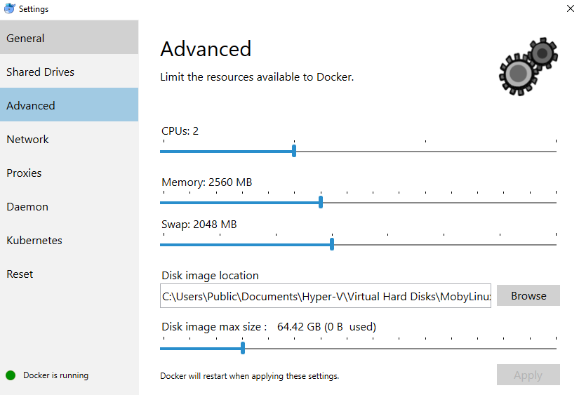

# AnyQuiz REST API Container

This image provides a customized version of the official php:7.2-apache image which installs python2.7, pip and enables some apache functionality like rewrite, and the cgi module, as well as the PHP PDO extension.

## Building the Docker Image

Building the docker image may require more memory and/or swap space be allowed to the Docker Service to allow containers to use more. 

## Example to run locally

`start_net.bat` - example to create a bridge network that both the aq-mysql container and this container should connect to
`start_aq.bat` - example to start up the AnyQuiz container with an example local bind to any_quiz repo code on windows, drive share needs to be enabled in docker