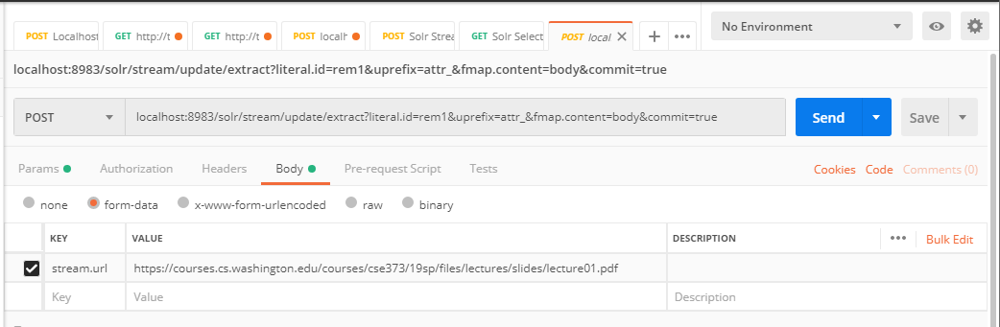
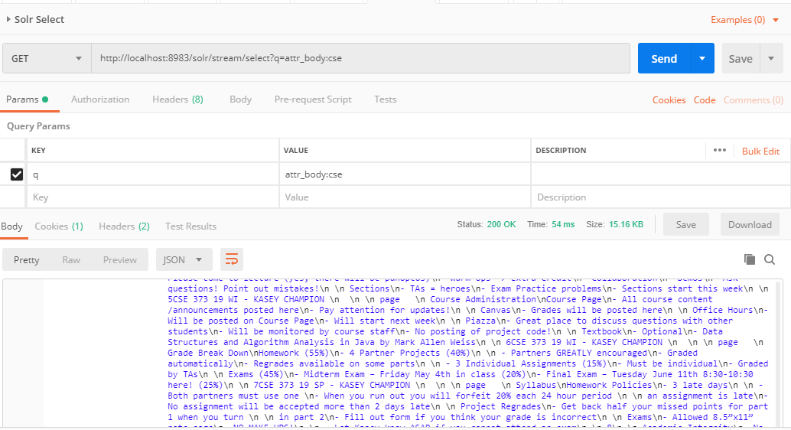

# Content Analysis with Apache Solr

## Example Usage

`POST localhost:8983/solr/stream/update/extract?literal.id=rem1&uprefix=attr_&fmap.content=body&commit=true`

with multipart/form-data

`stream.url=https://courses.cs.washington.edu/courses/cse373/19sp/files/lectures/slides/lecture01.pdf`

Searching for content is accomplished by using the `solr/stream/select` endpoint with the GET `q` parameter. The structure of the query is `<field>:<keyword>`. 

 * `*:*` searches all fields for anything, and will return all results
 * `attr_stream_name:lecture*` matches URLs that originally contained `lecture` in the URL
 * `attr_body:cse` searches the `attr_body` field (where extracted content can be accessed), for the string `cse`

More
 * [Solr's Standard Query Parser](https://lucene.apache.org/solr/guide/7_7/the-standard-query-parser.html#TheStandardQueryParser-WildcardSearches)

`GET http://localhost:8983/solr/stream/select?q=attr_body:cse`

